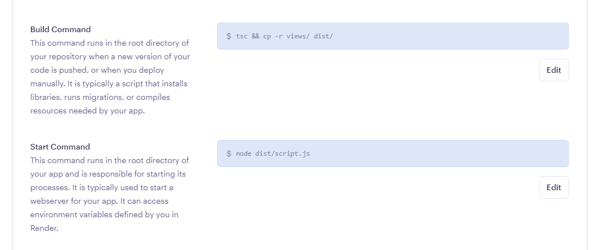

## key points

- notes for deploying to render.
- small things have to change from dev to production.

typescript's `tsc` command will only 'build' `.ts` files.

which is fine for a RESTFUL api app.

but if doing server-side rendering the dist file will not be able to see the `/views` file in the root directory.

soltuion:

---

change `app.set("views", path.join(__dirname, "/views"));`

to -> `app.set("views", path.join(__dirname, "../views"));`

---

or

`cp -r` the `/views` folder into `/dist` on build (in render) and keep `app.set("views", path.join(__dirname, "/views"));`

---
