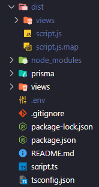

deploying a node+express app using prisma (postgresql).
Postgres hosted on elephantsql.
Node+express hosted on render.

practice app: https://github.com/Michaelleojacob/testing-elephantsql

### compiling ts

run command `tsc` in the terminal

```js
tsc;
```

`tsc` will compile typescript into a `./dist` folder.

But it only targets `.ts` files.

`.ejs` files and `.html` will be ignored.

`./dist` will be unable to see `/views` in the `root` directory

### using `views` in `./dist` compiled by `tsc`

file structure:



Several options when attempting to deploy the `./dist` folder:

---

If not building views in `./dist`:

```js
app.use(express.json());
app.set("views", path.join(__dirname, "../views"));
app.set("view engine", "ejs");
```

---

on render -> building views in `./dist` :

this will copy the view and throw it in `./dist`.

```js
// on render.com -> build command:
`tsc && cp -r views/ dist/`;
```

```js
app.use(express.json());
app.set("views", path.join(__dirname, "../views"));
app.set("view engine", "ejs");
```

---
