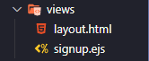

## key points

- file structure for ejs views
  <br>
  <br>
- node boilerplate to use ejs
- ejs layout
- using ejs layout in child extentions

---

## file structure:



---

## ejs node boilerplate:

```js
app.set("views", path.join(__dirname, "/views"));
app.set("view engine", "ejs");
```

---

## ejs layout

```js
// layout.html
<!DOCTYPE html>
<html lang="en">
  <head>
    <meta charset="utf-8" />
    <meta name="viewport" content="width=device-width,initial-scale=1" />
    <title>testing-elephantsql</title>
  </head>
  <body></body>
</html>
```

---

## ejs extends layout in child component

```js
// signup.ejs
<%- include('layout.html') -%>

<h1>Users</h1>
<ul id="users">
  <% users.forEach(function(user){ %>
  <li>username: <%= user.username %> id:<%= user.id %></li>
  <% }) %>
</ul>

<form
  method="post"
  style="display: flex; flex-direction: column; max-width: 200px"
>
  <label for="username">user name</label>
  <input type="text" name="username" />
  <label for="password">password</label>
  <input type="text" name="password" />
  <label for="confirmpw">confirm password</label>
  <input type="text" name="confirmpw" />
  <button type="submit" style="margin-top: 0.5rem">signup</button>
</form>

<% if(locals.errors){ %>
<ul>
  <% errors.forEach((err) => { %>
  <li><%= err.msg %></li>
  <% }) %>
</ul>
<% } %>
```
