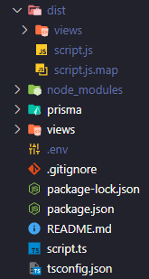

## key points

- small differences between local and production enviroments (pre/post deploy)
- covers those small differences during dev enviroment vs production

---

## app info

- not a resfult app
- server side rendering via ejs
  <br>
  <br>
- deploy a postgres prisma express web service on render
- Postgres db hosted on elephantsql.

---

## tech

- node
- express
- prisma (postgres)
- typescript
- ejs templating

practice app: https://github.com/Michaelleojacob/testing-elephantsql

---

## issues faced while deploying to the practice app to render:

run command `tsc` in the terminal

```
tsc
```

`tsc` will compile typescript into a `./dist` folder.

But it only targets `.ts` files.

`.ejs` files and `.html` will be ignored.

`./dist` will be unable to see `/views` in the `root` directory

### using `views` in `./dist` compiled by `tsc`

file structure:



Several options when attempting to deploy the `./dist` folder:

---

If not building views in `./dist`:

```js
app.use(express.json());
app.set("views", path.join(__dirname, "../views"));
app.set("view engine", "ejs");
```

---

on render -> building views in `./dist`

this will copy the view and throw it in `./dist`.

```
// on render.com -> build command:
`tsc && cp -r views/ dist/`
```

```js
app.use(express.json());
app.set("views", path.join(__dirname, "../views"));
app.set("view engine", "ejs");
```

---
